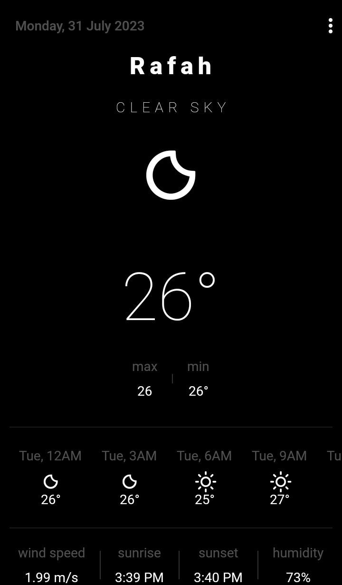

# Weather

A Flutter project to view current weather status.

## Features

- Beautiful minimal UI
- Current weather by location or by city name
- Dark and Light themes
- Current temperature, max and min temperature, sunset, sunrise
- Custom icons for each weather condition
- 5 days forecast
- Persist location and weather data in local storage
- Works offline (user need to download data before)
- Automatically refresh data every 15 minutes
- Bloc architecture, Dio

## Screenshots

<table>
<tr><td colspan="2">Light</td></tr>

  <tr> 
<td>   </td>
    <td>    </td>
  </tr>
<tr><td colspan="2">Dark</td></tr>

  <tr>
     <td>  </td>
    <td>  </td>
  </tr>

</table>

